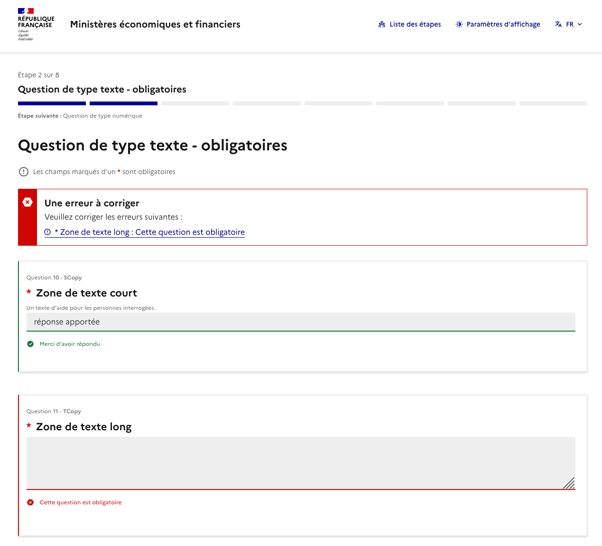

# Thème DSFR pour LimeSurvey

Thème LimeSurvey conforme au [Système de Design de l'État (DSFR)](https://www.systeme-de-design.gouv.fr/) et au [RGAA 4.1](https://accessibilite.numerique.gouv.fr/).

> **Utilisation réservée aux sites Internet de l'État.** Le DSFR représente l'identité numérique de l'État. Voir les [conditions générales d'utilisation du DSFR](https://github.com/GouvernementFR/dsfr/blob/main/doc/legal/cgu.md).

---

## En bref

<table>
<tr>
<td valign="top">

- **Accessibilité** — **100 %** RGAA 4.1 hors CAPTCHA
- **Design** — 100 % DSFR, zéro Bootstrap résiduel, mode clair/sombre natif
- **Questions** — 36 types supportés avec templates DSFR dédiés
- **Autonomie** — ressources locales (polices, icônes, JS), aucun CDN
- **Responsive** — mobile-first, linéarisation des tableaux <768 px
- **Impression** — layout dédié, 32 templates print par type de question
- **i18n** — français et anglais, sélecteur de langue DSFR

</td>
<td valign="top" width="380">

</td>
</tr>
</table>

---

## Installation

Le thème s'installe directement dans une instance LimeSurvey à partir de l'archive de [release](../../releases/latest) :

1. Télécharger l'archive `.zip` de la dernière release
2. Depuis l'administration LimeSurvey : **Configuration > Thèmes > Importer**
3. Activer le thème **DSFR** sur les sondages souhaités

Alternative : copier manuellement le contenu du dépôt dans `upload/themes/survey/dsfr/` de l'instance LimeSurvey, puis l'activer depuis **Configuration > Thèmes**.

### Mise à jour depuis une version ≤ 1.2.x

La release **v1.3.0** supprime le fichier legacy `css/dsfr-no-datauri.min.css` (remplacé par `css/dsfr.min.css` fourni par DSFR ≥ 1.13). LimeSurvey stocke la liste des CSS du thème en base (`lime_template_configuration.files_css`) et peut continuer à référencer l'ancien fichier après mise à jour — résultat : 404 sur le CSS principal, boutons sans style, thème cassé.

Après avoir importé ou remplacé la nouvelle version, il faut **réinitialiser la configuration du thème** :

1. **Configuration > Thèmes > DSFR > Étendre** puis bouton *Réinitialiser ce thème*
2. (ou en SQL) `UPDATE lime_template_configuration SET files_css = REPLACE(files_css, 'dsfr-no-datauri.min.css', 'dsfr.min.css') WHERE template_name = 'dsfr';` puis purger `tmp/assets/`

Aucune action nécessaire pour une installation neuve.

### Pour tester ou contribuer

Le repo [`bmatge/limesurvey-dsfr-suite`](https://github.com/bmatge/limesurvey-dsfr-suite) fournit un environnement Docker prêt à l'emploi (LimeSurvey 6 + MySQL + questionnaire de test RGAA + suite de tests) qui monte ce thème en direct. Il sert au développement et à la validation a11y ; il n'est **pas** requis pour utiliser le thème en production.

---

## Documentation

| Document | Pour qui |
|---|---|
| **[`THEME_COVERAGE.md`](THEME_COVERAGE.md)** | Ce que le thème prend en charge : types de questions, composants DSFR, scripts front, ressources |
| **[`THEME_OPTIONS.md`](THEME_OPTIONS.md)** | Options configurables depuis le back-office LimeSurvey (6 onglets) |
| **[`DECLARATION_RGAA.md`](DECLARATION_RGAA.md)** | Déclaration d'accessibilité complète (audit + corrections) |
| **[`DECLARATION_RGAA_AUDIT_INITIAL.md`](DECLARATION_RGAA_AUDIT_INITIAL.md)** | Résultat brut de l'audit initial |
| **[`CONTRIBUTING.md`](CONTRIBUTING.md)** | Guide développeur : arbo `src/`, pipeline esbuild, Twig, workflow git |
| Tests (couverture, lancement, rapports) | Dans le repo [`bmatge/limesurvey-dsfr-suite`](https://github.com/bmatge/limesurvey-dsfr-suite) |

---

## Licence

[Licence Ouverte v2.0 (Etalab)](https://www.etalab.gouv.fr/licence-ouverte-open-licence/).

---

## Auteur

**Mission Ingénierie du Web, Service du Numérique** — Ministère de l'Économie et des Finances

- GitHub : [@bmatge](https://github.com/bmatge)
